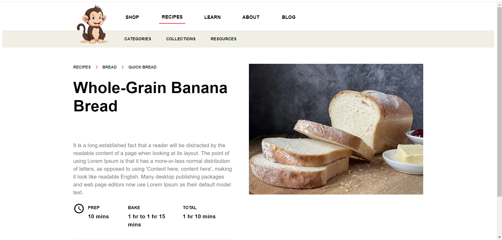
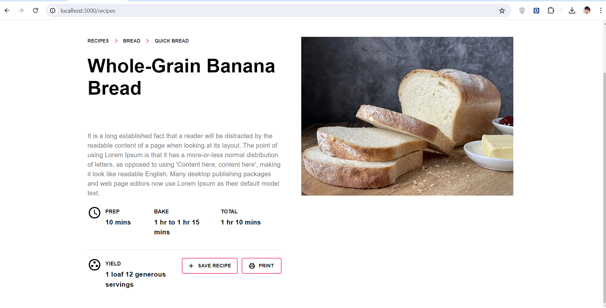
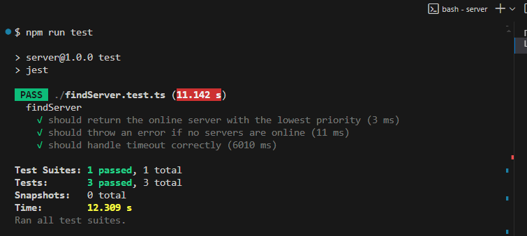

## Getting Started

First, run the FE:

```bash
cd client/
npm i
npm run dev
# or
yarn dev
# or
pnpm dev
# or
bun dev
```



Open [http://localhost:3000](http://localhost:3000) with your browser to see the result.

Second, run the BE:

```bash
cd server/
npm i
npm run test
```


